# Workplace Safari
## Azure Python Device Setup
As part of the demo within Microsoft VSCode to simulate Azure Python Functions, all of the pre-installed items are free for anyone to download and use. This README provides detail on what was pre-installed and how so you could easily replicate this setup on a personal computer.

---

## Azure Functions Core Tools 4.#
### What is it?
`Tools to allow simulation of running Azure Functions on a local personal computer environment. Where a cloud hosted function is accessible via an internet URL, the local simulation will bind the function listener to a local port on a loopback address that can be accessed on the same personal computer (e.g. http://127.0.0.1:7700)`

### Download
[Azure Functions Core Tools - Python](https://learn.microsoft.com/en-us/azure/azure-functions/functions-run-local?tabs=windows%2Cisolated-process%2Cnode-v4%2Cpython-v2%2Chttp-trigger%2Ccontainer-apps&pivots=programming-language-python#install-the-azure-functions-core-tools)

From the link above, part way down the page you will see this section where tabs exist for your Operating System type (Windows, macOS, Linux) and then links for your Windows version. Most new versions of Windows (10-11) will be 64-bit, search online to find out how to check your PC.

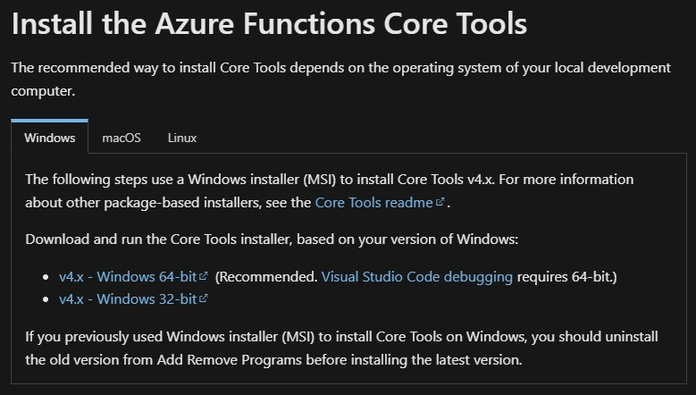

### Installation Steps
Select all default options: **Next** > **Accept EULA** > **Next** (Install Path > **Install**)

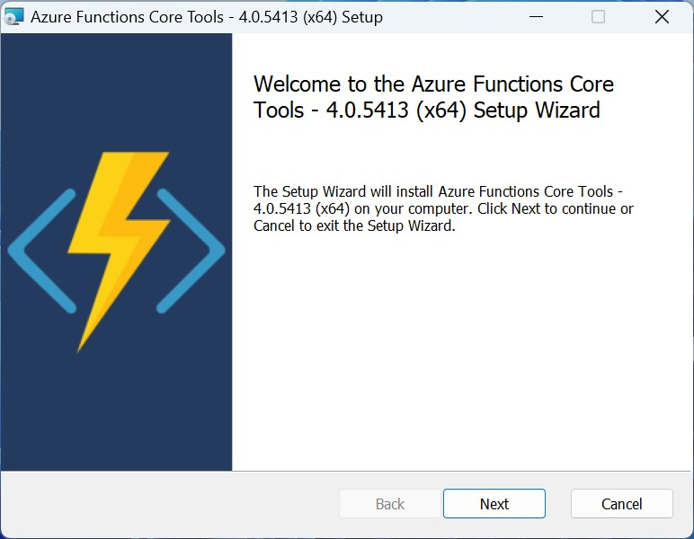

---

## Python 3.11.#
### What is it?
`Programming language SDK/engine, the templates we use are coded using the Python programming language.`

### Download
[Python for Windows](https://www.python.org/downloads/windows/)

**NOTE:** At the time of this (November 2023), newer versions than 3.11.# were not supported by Azure Functions.

From the link above, scroll down the page to find the 3.11.# version to download (nothing newer, like 3.12.#)

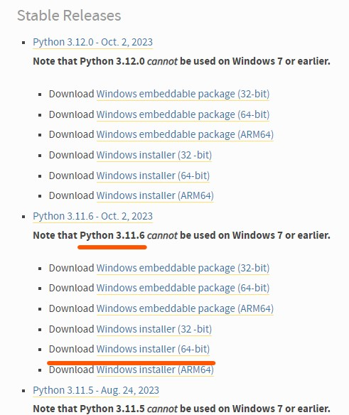

### Installation Steps
Select (tick) **Use admin priviledges when installing py.exe** and select (tick) **Add python.exe to PATH**

**NOTE:** The `PATH` setting will enable you to type 'python' at a command prompt without having to specify a full path of where the installation is located.

Click **Install Now**

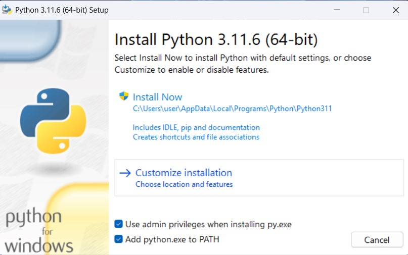

The `PATH` setting will require a reboot to take effect, but you can wait until after installing the DotNet SDK as that will also benefit from a reboot.

---

## DotNet SDK 7.#
### What is it?
`Programming language SDK/engine, we are not actually programming using DotNet. But Azure Functions Core Tools will leverage some elements from this SDK.`

### Download
[DotNet Download](https://dotnet.microsoft.com/en-us/download)

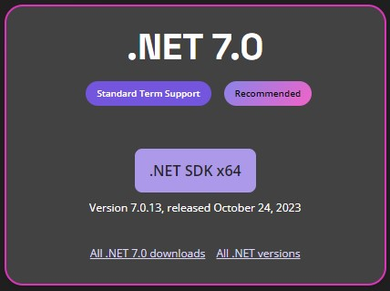

### Installation Steps
Select **Install**, wait for installation to complete and click **Close**, reboot your PC.

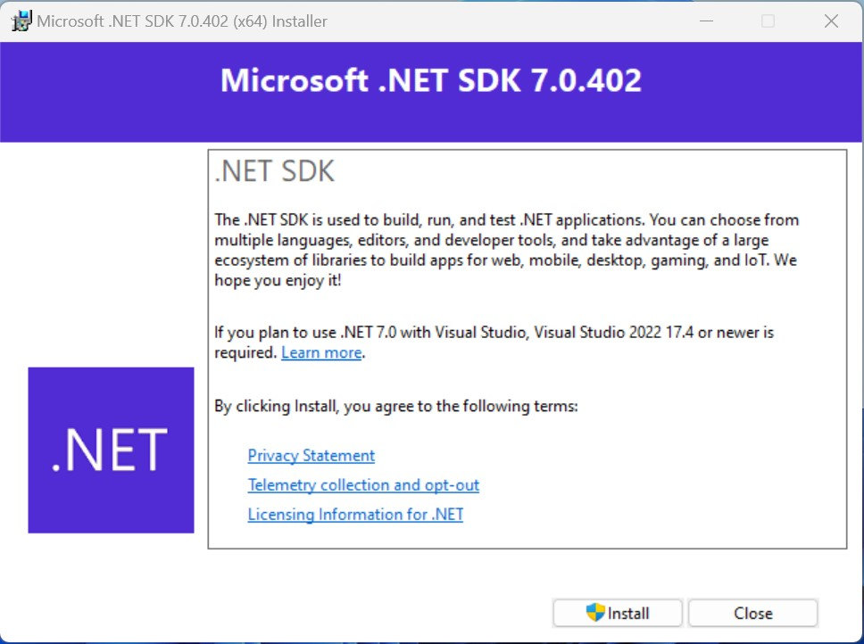

---

## Microsoft VSCode
### What is it?
`Visual Studio Code is a streamlined code editor with support for development operations like debugging, task running, and version control. It aims to provide just the tools a developer needs for a quick code-build-debug cycle.`

### Download
[VSCode Download](https://code.visualstudio.com/download)

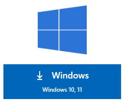

### Installation Steps
Click **Next** EULA Accept > **Next** (installation location) > **Next** (Start menu folder) > **Next** (Additional Tasks) > **Install**

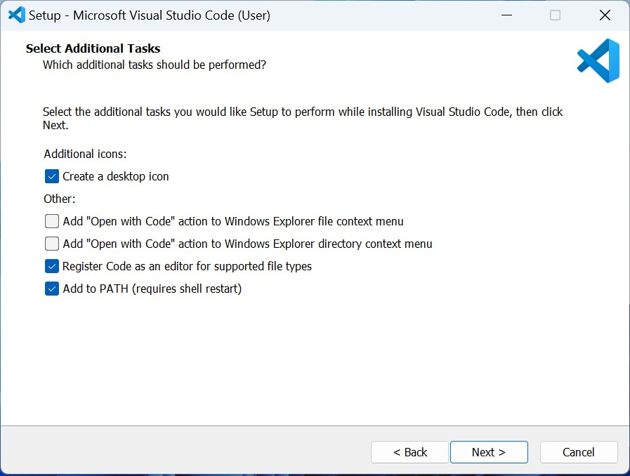

### VSCode Extensions
### What are these?
`Like on an Internet browser or a games console, VSCode also has extensions to add functionality and convienience. For the excercises we carry out we've pre-installed the following extensions.`

Click on this icon in the left side bar to visit the extensions marketplace.

**TIP:** When browsing extensions, you'll see the number of downloads they have already had. This is a good indicator of how good and trust-worthy an extension is.

### Python
We'll primarily be working with Python, this extension colour codes text in '.py' files and provides prompts (intellisense) to inform you when coding in Python.

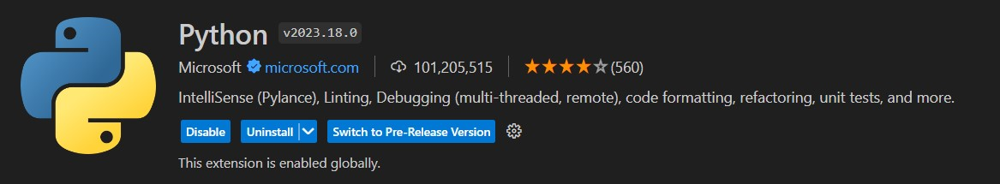

### Azure Tools
Search for and install **Azure Tools**, this incorporates a full suite of Microsoft Azure extensions, so its a one-stop shop to get everything you need for Azure.

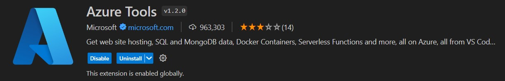

### Azurite
Because we'll be simulating Azure Serverless Functions locally, we want to simulate a Storage Account locally that can host the changing files of the function as it operates.

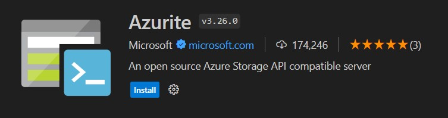

### Thunder Client
We're going to be using HTTP requests (REST Requests), you can use a REST browser (like Insomnia or Postman), but Thunder Client is a great solution built into VSCode. This will be used to send requests to trigger an HTTP function into starting.

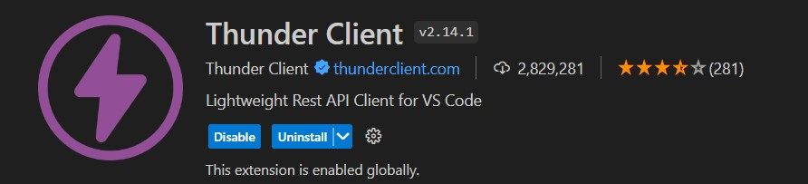

---
