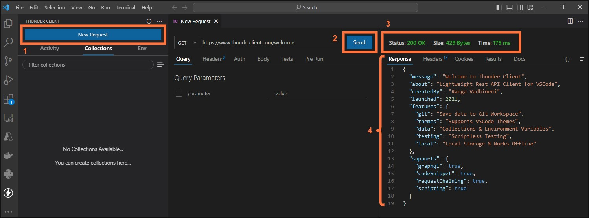

# Workplace Safari
## Movie/TV Show Search & Submit (via REST API)
This excercise is to access a public API hosting TV Show data, you'll use the search query find a TV show that you have watched, are watching or plan to watch. You'll then obtain the ID of the show and submit that along with your name to a function we have created at Content+Cloud. The function hosted on Microsofts Cloud Platform (Azure) will use the ID to download the TV Show seasons and episode details.

---

## VSCode Thunder Client
### What are we doing?
Using the Thunder Client extension installed within VSCode to search the TVMaze Database (via API).

An API request is similar to visiting a website but the response is in a raw data form instead of a visual representation. This allows for large amounts of data to be collected very quickly.

### Exercise Steps
#### Step 1.

Open VSCode from the desktop icon

---

#### Step 2.

Locate the Thunder Client icon down the left sidebar and click it

---

#### Step 3.

Click on `New Request` and then click on `Send`, you should get a 200 response code along with a response body (JSON format)

- `2XX` codes are successful responses
- `3XX` codes are redirect codes (diverting the requestor elsewhere)
- `4xx` codes are client side errors (problem at the requestor)
- `5xx` codes are server side errors (problem at the server being requested)

#### Step 4.

Now edit the request address (URL), remove `https://wwww.thunderclient.com/welcome` and replace with 

### `https://api.tvmaze.com/search/shows`

You also need to specify a parameter, this will be the word/s that you want to use to search for your TV Show:

- Specify a key (parameter) of `q`
- Specify a value (your search term)

Then click on `Send` again, you might get multiple results. Scroll through to find the TV Show you were looking for. You're looking at the name field and then finding the `id`

#### Step 5.

Now you have found your TV Show and have the `id` of the show on the TVMaze API, click to create a `New Request` within th Thunder Client.

This time you are not going to make a request to a public API, but to a bespoke function that we've created at Content+Cloud.

**What is a function?** A single dedicated (coded) operation (set of instructions). Often triggered on demand. Doesn't have a dedicated server, but is often referred to as `serverless`. Compute resources (a group of servers) are used to allocate their compute power to run functions when demanded (via a request or maybe a timer, or other trigger).

Your new request will be to the address (URL) `https://wps-tvmaze.azurewebsites.net/api/submit`

Two parameters will need to be provided this time:

- First parameter `name`, Value `Your Name`
- Second parameter `show_id`, Value `the id from your previous search results`

Click on `Send`, you should receive a response confirming the name of the show that you have submitted.

---
