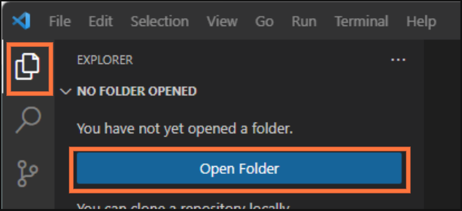
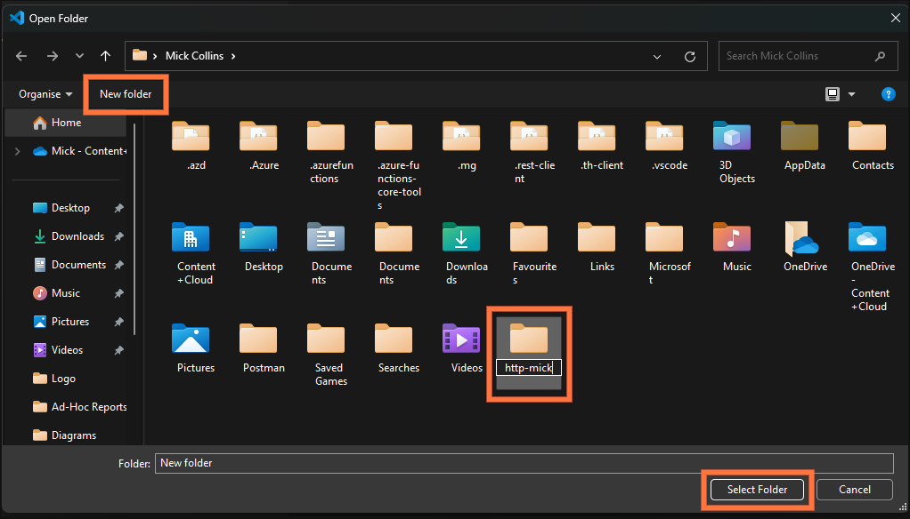
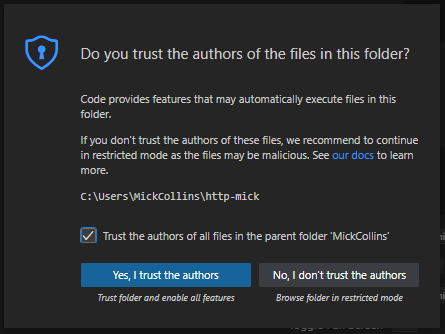
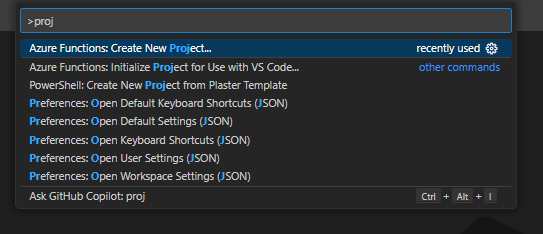
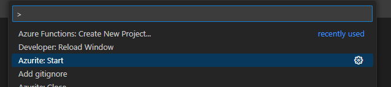
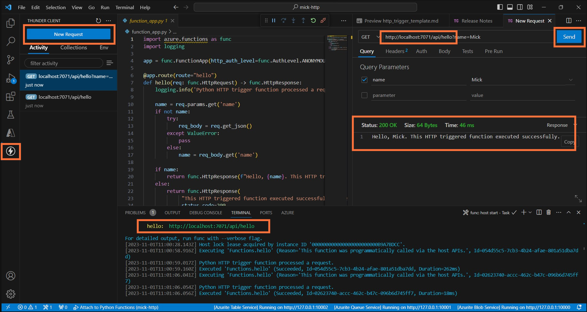

# Workplace Safari
## Hosting local Azure HTTP Function (simulation)
In this excercise you'll create an HTTP function from an Microsoft Azure template that can be generated directly within VSCode, you will then run the function locally to simulate it working, this will allow you to send a request and test the response using the Thunder Client again.

---

## VSCode Azure Template Project
### What are we doing?
Setting up a working folder for this project/excercise and populating it with a template function, to then simulate locally as it would run within the cloud environment once deployed.

### Exercise Steps
#### Step 1.

With VSCode already open, navigate to the Explorer icon in the top left, then click on the blue button to `Open Folder`.

---

The `Open Folder` window will appear

Click on the `New Folder` button

Name your folder, double click on it

Then click on `Select Folder`

---

If the following prompt displays you can click on `Yes, I trust the authors`

---

#### Step 2.

You now need to initialise an Azure Project via the Command Palette, to do this you can do one of the following:

- On your keyboard, hold down `Ctrl` and `Shift`, then press the `P` key.
- Click on the `View` menu and select `Command Palette`

In the list you are then looking for an option called `Azure Functions: Create New Project...` (you can type the word `proj` to filter the options if needed).

Click of press the `Return` key on your keyboard to select `Azure Functions: Create New Project...`

You then need to select a sequence of options as follows (using the click of the mouse or the return key on your keyboard)

- Select your folder name that you created previously
- Select the `Python` programming language
- Select `Model V2`
- Select the Python interpreter listed, this should be `python 3.11.6`
- Select the template called `HTTP trigger`
- You can specfiy a name for your trigger or accept the default suggestion
- Select ANONYMOUS for the authorisation level

Now wait a moment whilst in the bottom right corner an environment will be created.

---

#### Step 3.

You now need to start a storage emulator (as we are not deploying the function to actual cloud storage at this moment and just running it locally on your PC).

Open the Command Palette again, via either:

- On your keyboard, hold down `Ctrl` and `Shift`, then press the `P` key.
- Click on the `View` menu and select `Command Palette`

Find and select the option `Azurite: Start`

---

Now on your keyboard find and press the `F5` key.

You will be prompted about connecting to storage, click the button for `Use Local Emulator`

---

At this point if we've done everything correctly to this point you should have a running local simulation of an HTTP function that will accept a `name` parameter.

As you did earlier, open the `Thunder Client` on the left menu pane, click on `New Request` and you need to type or copy the URL that is displayed in the bottom `Terminal` window pane.

It will be something like: 
## http://localhost:7071/api/http_trigger

### When fully operational your screen should look very busy and somethig like this...

---

# Talk About Free Azure Resources for Students

# https://azure.microsoft.com/en-gb/free/students

