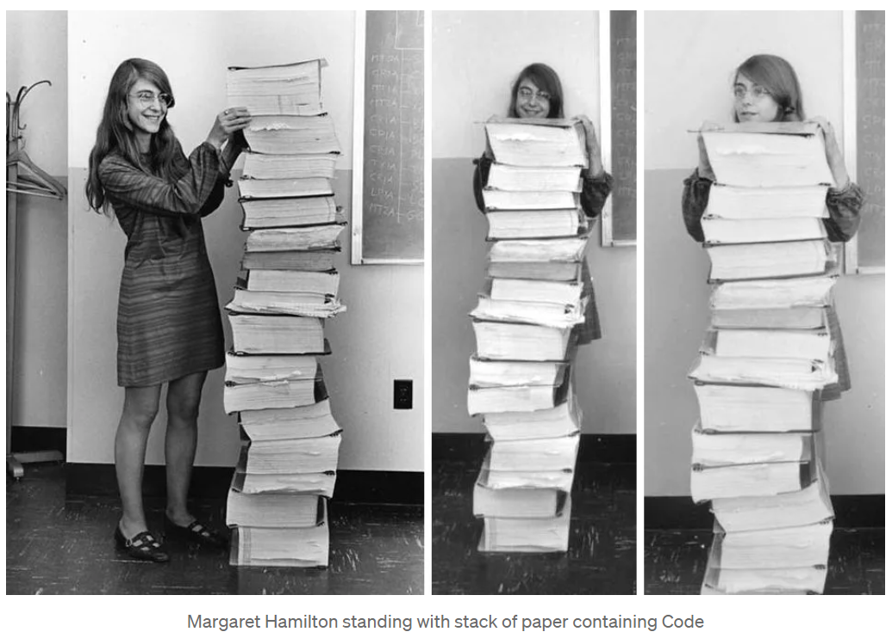

# Code Efficiency
## NASA Apollo 11 Moon Landing 1969

#### Reference: https://medium.com/@sachinmittal24687/code-to-moon-apollo-11-mission-f06468649d7c

### In 1969, NASA launched Apollo 11 mission, and MIT programmers were assigned to design software to make for this program.

MIT Programmers invented Apollo Guidance Computer( AGC ) that made the first moon landing possible. AGC was made to receive input from astronauts, and then it should be able to give commands to aircraft. MIT Programmers created a “Special Assemble Language” for it. This language is complicated to understand for humans but can be interpreted by computers very easily.

### This complete Code consists of `145,000` lines that successfully landed Apollo 11.

### This Code was written so perfectly that no bugs were founded in code at the time of future Apollo missions.
### In 2003, NASA honored her achievements with the largest financial award. She also got the Presidential Medal of Freedom.

## How Many (Millions) of Lines of Code Does It Take?

### https://www.visualcapitalist.com/millions-lines-of-code/
